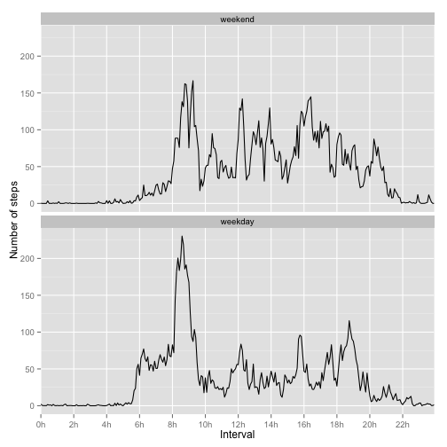

## Loading and preprocessing the data

The first step is to unzip the data we just downloaded from the repository. Then, knowing that the NA string is "NA", we can read the csv file and take a look at the data. 


```r
unzip("activity.zip")
data <- read.csv("activity.csv", stringsAsFactors = F, na.strings = "NA")
str(data)
```

```
## 'data.frame':	17568 obs. of  3 variables:
##  $ steps   : int  NA NA NA NA NA NA NA NA NA NA ...
##  $ date    : chr  "2012-10-01" "2012-10-01" "2012-10-01" "2012-10-01" ...
##  $ interval: int  0 5 10 15 20 25 30 35 40 45 ...
```

The column "interval" represents 5-minute windows during the given date. This is easier to note if we look at the last columns of the dataset.


```r
tail(data)
```

```
##       steps       date interval
## 17563    NA 2012-11-30     2330
## 17564    NA 2012-11-30     2335
## 17565    NA 2012-11-30     2340
## 17566    NA 2012-11-30     2345
## 17567    NA 2012-11-30     2350
## 17568    NA 2012-11-30     2355
```

Now it is clear that the values of the interval columns give us the starting time (hour and minutes) of the next 5-minute window, represented as an integer. We need to transform this column into seconds to make it easier to handle. We also transform the date column form string into date.


```r
data$date <- ymd(data$date)

interval <- sprintf("%04s", data$interval) # hhmm
interval <- sprintf("%s:%s", substr(interval,1,2), substr(interval,3,4)) # hh:mm
data$interval <- period_to_seconds(hm(interval))

data <- tbl_df(data)
str(data)
```

```
## Classes 'tbl_df', 'tbl' and 'data.frame':	17568 obs. of  3 variables:
##  $ steps   : int  NA NA NA NA NA NA NA NA NA NA ...
##  $ date    : POSIXct, format: "2012-10-01" "2012-10-01" ...
##  $ interval: num  0 300 600 900 1200 1500 1800 2100 2400 2700 ...
```

```r
data
```

```
## Source: local data frame [17,568 x 3]
## 
##    steps       date interval
## 1     NA 2012-10-01        0
## 2     NA 2012-10-01      300
## 3     NA 2012-10-01      600
## 4     NA 2012-10-01      900
## 5     NA 2012-10-01     1200
## 6     NA 2012-10-01     1500
## 7     NA 2012-10-01     1800
## 8     NA 2012-10-01     2100
## 9     NA 2012-10-01     2400
## 10    NA 2012-10-01     2700
## ..   ...        ...      ...
```

## What is mean total number of steps taken per day?

The first thing we want to do is to compute the mean is to compute the total number of steps taken per day and to plot a histogram with this data. This histogram also shows the mean of this data. For this analysis, we remove all NA from the dataset.


```r
stepsPerDay <- data %>%
                select(date, steps) %>%
                filter(!is.na(steps)) %>%
                group_by(date) %>%
                summarise(sum = sum(steps))
summary <- summary(stepsPerDay$sum)
summary
```

```
##    Min. 1st Qu.  Median    Mean 3rd Qu.    Max. 
##      41    8841   10760   10770   13290   21190
```

```r
meanPerDay <- summary["Mean"]
medianPerDay <- summary["Median"]

g <- ggplot(stepsPerDay, aes(date, sum))
g + geom_bar(stat="identity", colour="steelblue", fill="steelblue") +
    ylab("Total steps") +
    
    # Draw horizontal mean
    geom_hline(aes(yintercept = meanPerDay, linetype = "mean"),
               colour = "red", show_guide = T) +
    
    # Add aesthetic mapping to create legend
    scale_linetype_manual("Stats", values = c("mean" = 1))
```

 

## What is the average daily activity pattern?

In order to compute this average we need to group our data by interval and, just like before, we remove all NA from the dataset.


```r
dailyActivity <- data %>%
                    select(steps, interval) %>%
                    filter(!is.na(steps)) %>%
                    group_by(interval) %>%
                    summarize(mean = mean(steps))
g <- ggplot(data = dailyActivity, aes(interval, mean))
g + geom_line() +
    ylab("Average number of steps") +
    xlab("Interval") +
    scale_x_discrete(
        breaks=seq(0, 86400, 7200), # one every 7200 seconds (2 hours)
        labels=paste(seq(0,24,2), "h", sep="")
    )
```

 

From the previous graphic we can see that the maximum number of steps (in average) among all 5-minute interval is:


```r
max <- max(dailyActivity$mean)
max
```

```
## [1] 206.1698
```

```r
seconds_to_period(
    dailyActivity[dailyActivity$mean == max,"interval"]
)
```

```
## [1] "8H 35M 0S"
```

## Imputing missing values

In total, the dataset contains 2304 missing values. Because their precense may introduce bias into some calculations or summaries of the data, we create a new dataset, copying the original and filling the NA with the mean of the corresponding 5-minute interval.


```r
completeData <- data
naIndexes <- which(is.na(completeData$steps))
for(i in naIndexes) {
    naInterval <- completeData$interval[i]
    naMean <- dailyActivity$mean[which(dailyActivity$interval == naInterval)]
    completeData$steps[i] <- naMean
}
```

With this new dataset, lets plot again the histogram of steps during the day to see if there is a difference with the previous one.


```r
stepsPerDay <- completeData %>%
                select(date, steps) %>%
                group_by(date) %>%
                summarise(sum = sum(steps))
completeSummary <- summary(stepsPerDay$sum)
completeSummary
```

```
##    Min. 1st Qu.  Median    Mean 3rd Qu.    Max. 
##      41    9819   10770   10770   12810   21190
```

```r
completeMeanPerDay <- completeSummary["Mean"]
completeMedianPerDay <- completeSummary["Median"]

g <- ggplot(stepsPerDay, aes(date, sum))
g + geom_bar(stat="identity", colour="steelblue", fill="steelblue") +
    ylab("Total steps") +
    
    # Draw horizontal mean
    geom_hline(aes(yintercept = completeMeanPerDay, linetype = "mean"),
               colour = "red", show_guide = T) +
    
    # Add aesthetic mapping to create legend
    scale_linetype_manual("Stats", values = c("mean" = 1))
```

 

It can be seen that the new figure includes bars in all dates. Also the median has changed from the previous value 10760 to 10770. On the other hand, the mean did not change. This was expected as we filled the NA values with the mean of their corresponding interval.

It can also be seen than the first and third quartile also changed, reflecting the addition of the new mean values.

## Are there differences in activity patterns between weekdays and weekends?

For the last part of this study, we are going to compare the average activity between weekdays and weekends using a line plot.

To make the comparison possible, we need to create a factor variable to split the data in weekdays and weekends.


```r
Sys.setlocale(category = "LC_TIME", locale = "en_GB")
```

```
## [1] "en_GB"
```

```r
completeData$typeOfDay <- weekdays(completeData$date)
completeData$typeOfDay <- sub("^S.+", "weekend", completeData$typeOfDay)
completeData$typeOfDay <- sub("^[^w].+", "weekday", completeData$typeOfDay)
completeData$typeOfDay <- factor(completeData$typeOfDay,
                                    levels = c("weekend", "weekday"))

dailyActivity <- completeData %>%
                    select(typeOfDay, interval, steps) %>%
                    group_by(typeOfDay, interval) %>%
                    summarize(mean = mean(steps))
g <- ggplot(data = dailyActivity, aes(interval, mean))
g + geom_line() +
    facet_wrap(~ typeOfDay, ncol=1) +
    ylab("Number of steps") +
    xlab("Interval") +
    scale_x_discrete(
        breaks=seq(0, 86400, 7200), # one every 7200 seconds (2 hours)
        labels=paste(seq(0,24,2), "h", sep="")
    ) + theme_bw()
```

 

Two clearly different patterns can be seen from these plots. On weekends, people walk more during the day, achieving peaks higher than 100 multiple times. On weekdays, people do most of the walk early in the morning (between 8am and 10am with the highest peak at 8am) then the walking drops significantly, achieving some peaks of 100 at 16h and 18h.


```r
summary(dailyActivity[dailyActivity$typeOfDay == "weekend", "mean"])
```

```
##       mean        
##  Min.   :  0.000  
##  1st Qu.:  1.241  
##  Median : 32.340  
##  Mean   : 42.366  
##  3rd Qu.: 74.654  
##  Max.   :166.639
```

```r
summary(dailyActivity[dailyActivity$typeOfDay == "weekday", "mean"])
```

```
##       mean        
##  Min.   :  0.000  
##  1st Qu.:  2.247  
##  Median : 25.803  
##  Mean   : 35.611  
##  3rd Qu.: 50.854  
##  Max.   :230.378
```

```r
qplot(interval, mean, data = dailyActivity, facets = .~typeOfDay,
      geom = "boxplot", ylab = "Number of steps", xlab = "")
```

 
